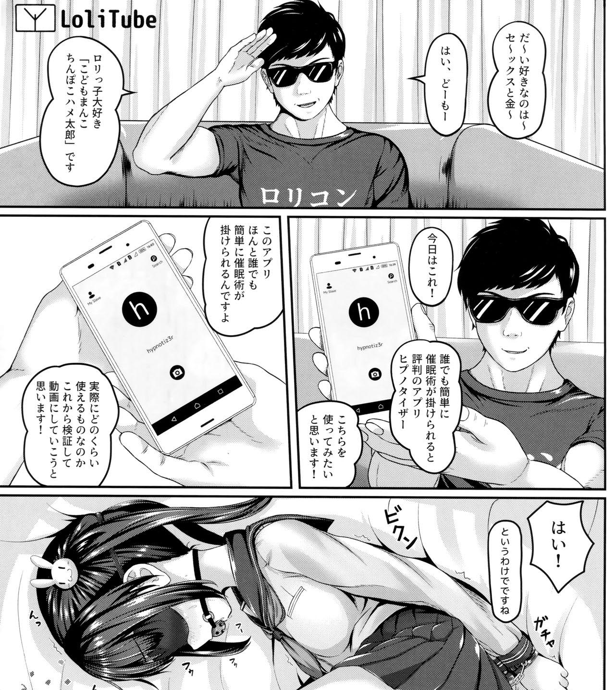
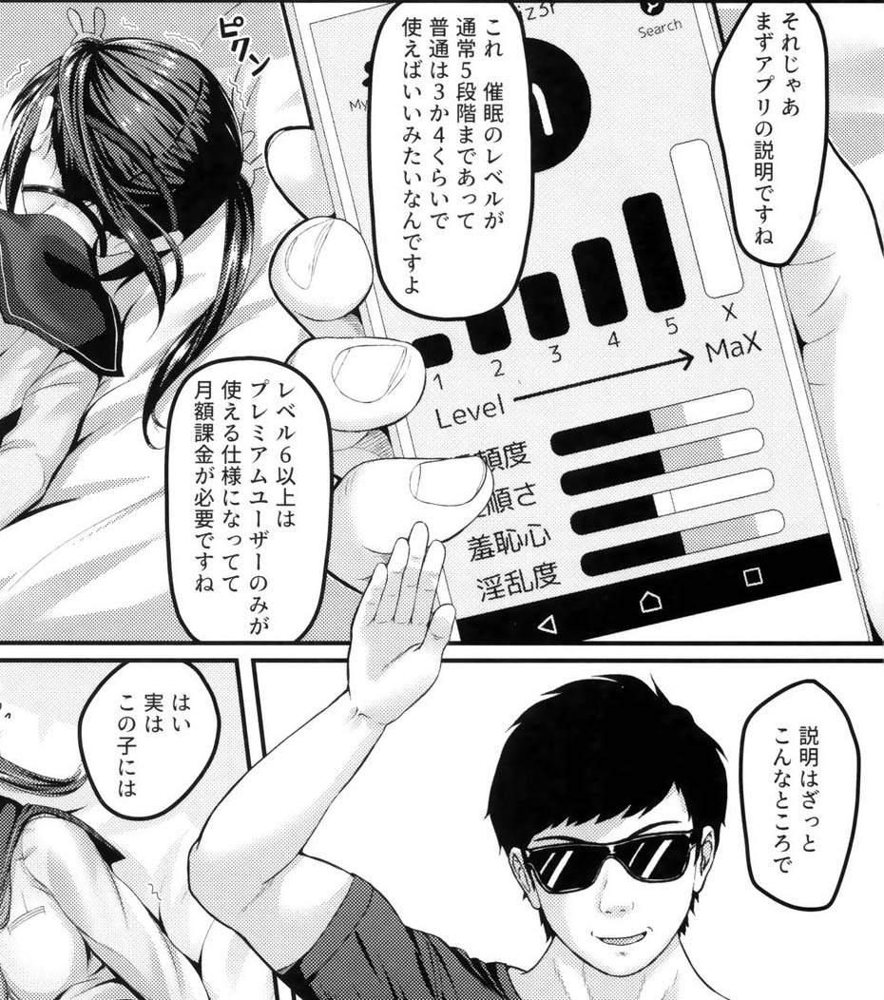

# 【幻朧月睨】催眠調教的app！

## 關於名字
因爲是催眠嘛，所以起了一個有催眠大師氣息的名字(笑)。   
一定要解釋的話「幻」与「朧」修飾「月」，「睨」做動詞。斜眼看虛幻且模糊的月。   
話說不知道什麼時候開始就很喜歡白髮紅眼這樣的設定了，感覺很不錯！

## 简介
话说最近经常看到這些科幻(?)的本子，果然科幻真是亙古不變的主題啊(笑)。然後順藤摸瓜就看到有人問「欸這app去哪裏下」之類的。   
不過這種東西這麼好用肯定是掌握在某些大公司的手上，然後放在某些商店裏付費下載呀。不過下載免費使用收費的說不定也有吧？催眠一次多少錢這樣，還有就是脫到一半然後彈出窗口要收錢的(笑)。   
不過如果是裝在surface上說不定啪啪啪到一半的時候會彈出來「性福倒計時」然後(笑)……   

所以本着開源共享的精神，我就實現了一個差不多的催眠調教的app。   
說不定明天就會有超級企業派特工來找我喝茶(笑)。

## 配置
在window，你可以直接:    
    
    pip install -r requirements.txt

然後
    
    python3 催眠.py

在Android，如果你不想重新編譯的話，可以去這裏下載我預編譯好的apk文件。

## 使用方法

> 「多麼美麗的花紋！多麼美麗的色彩！」
>
> 「啊，它真是美極了！」

## 實際效果

話說我怕是要被封號(笑)。